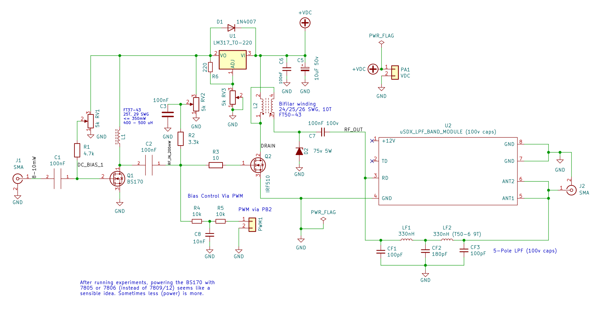
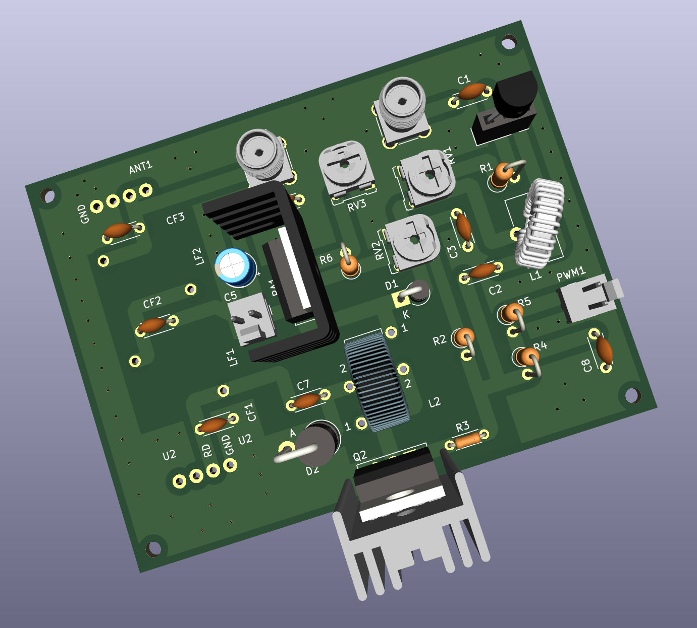
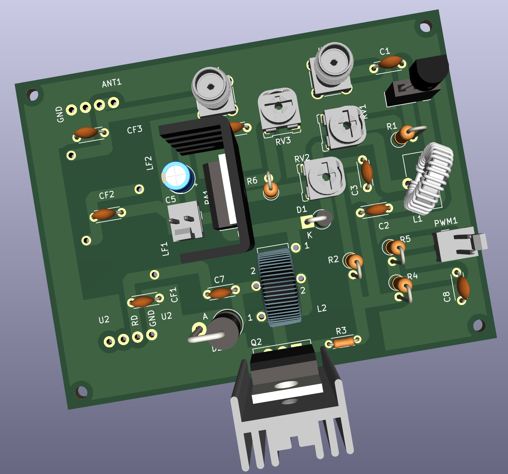
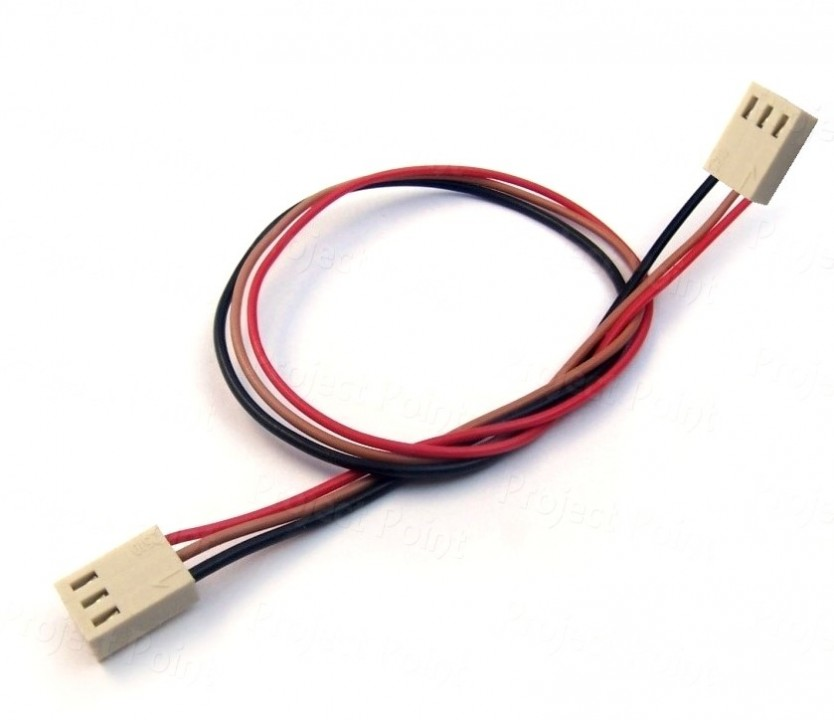
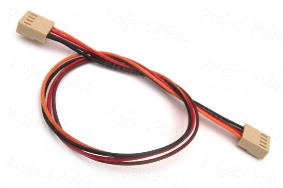

### HF-PA-v5

VU3CER's Robust `Class-D HF PA` for https://github.com/kholia/Easy-Digital-Beacons-v1
project for 40-20-17-15-10 bands.

For extra fun, use this PA with https://github.com/kholia/HF-Balcony-Antenna-System.

This design aspires to be the standard mW-to-QRP-Gallon HF PA in the ~600 INR
(8 USD) design space. Well, it does much more than QRP now...

Design Constraints:

- PCB is to be homebrewed.

- Only one PCB layer (side) is available for routing work.

- IRF510 MOSFET needs to be on an edge to allow usage of heatsinks.

- Typical external linears (e.g. `PA150 HF Linear Amp`) need 2W minimum to
  function. So we need a minimum of 2W of RF output from our design. Even at
  28 MHz.

- Minimal part count is strongly preferred. Low cost, and ease of availability
  are strong driving and deciding factors.

  The cost of this entire HF-PA-v5 system is less than one RD16HHF1 MOSFET ;)

- Reproducibility is a MUST! We focus a lot on this aspect by documenting each,
  and every detail possible.

- Repairability in the field is a MUST!

  Dhiru's finding: Repairing homebrewed PCBs is so much easier, and fun than
  reworking commercial `lead-free` PTH PCBs.

- No moving mechanical parts are allowed in the design - this rules out usage
  of (failure-prone) active cooling options like fans.

- We do NOT like the robustness of QCX, QDX, uSDX PAs. Removing heat from TO-92
  devices in a reliable way is not a trivial problem.

Note 0: All screenshots are clickable and zoomable.

Input: Few milliwatts is fine. Note: Si5351's output is around 8-10mW.

Output: See https://github.com/kholia/HF-PA-v4 for results.

Note 1: The output power is software controllable (via `PWM grounding`) for
flexibility.

Note 2: The idea behind making these (and my other) design notes publicly
available is to deliver REPRODUCIBLE, flexible, home-brewable, standardized,
reasonable, and cost-effective solutions for some common problems. I include
many references, simulations, and notes in my projects to enable you to do your
own (better) designs - do share them ;)

Robustness Notes:

- Ensure that the IRF510 is fastened securely to the heat sink.

  Use lock washers, and thermal epoxy adhesive to ensure good mechanical
  contact.

- We recommend operating at 24v instead of >= 29v.

Please see the older https://github.com/kholia/HF-PA-v2 project for the
power-supply (over-current protected), and LPF designs.

Schematic:

PCB rendering (v5):

Homebrew version of the same PCB:

Note 3: The HF PA is connected to a 20m dipole over 55 meters of HLF-200 coax.

Note 4: The PCB is done using [KiCad 6.x](https://www.kicad.org/download/) - a
free, and open EDA software.

Note 5: This PA can be homebrewed from scratch in around 4 to 6 hours (one
afternoon, and an evening).

#### Notes

[From QRP Labs] Si5351A outputs a 3.3v square wave. The power output of Si5351A
is around 8-10mW (10 dBm). The BS170 based driver circuit amplifies this to
~200mW (23 dBm) for a gain of around 13 dB. The IRF510 finals provide a gain of
around 14dB and produce around 5W of RF power.

Input drive matters the most in getting good RF output from IRF510. This is
precisely what Si5351A lacks (which is perfectly fine), and why the BS170
driver stage is necessary.

Important: Don't exceed the IRF510's gate limit of 1-2W. Keep the output of the
BS170 driver in check, and within the limits of IRF510.

For safety, keep the output of BS170 less than 22 or 23 Vpp by controlling the
BS170 PA voltage (via the LM317 trimpot).

#### PA tuning process

- Remove the BS170 and IRF510 MOSFETS from their sockets.

- Set DC gate bias for BS170 to 0v. Now increase the bias (via trimpot) until
  the current consumption increases slightly (QRP Labs' process).

  You can also start by setting the gate bias to 2v directly ;)

  The final bias value can be around 2.1v to 2.2v in many cases.

- For IRF510, set gate bias to 3v. This ensures that IRF510 isn't turned ON -
  double-check this by monitoring the power consumption.

- Connect the MOSFET back, and measure RF output. Happy with the output power? -
  If yes, you are done else follow the next steps.

- Remove the MOSFET, increase the gate bias voltage in very small increments
  (0.1v types).

- Connect the MOSFET back, and measure power consumption without any RF input.
  Ensure that MOSFET remains OFF without any RF input.

- Apply RF input, and measure RF output.

- Repeat these steps as needed.

The [QRP Labs' procedure for bias adjustment](https://www.qrp-labs.com/images/pa/pa_simple_assembly_A4.pdf) and [this document](https://www.qrp-labs.com/images/ultimate3s/assembly_u3s.pdf) seem to have a better description of this process.

#### PA BOM

- 1 x IRF510 (Genuine Vishay parts are tried-and-tested) - 22 to 50 INR

  - The `SEC` (`SEC Electronics Inc`) branded IRF510(s) also work great!

  - The `SEC IRF510` can perform even better than Vishay's version. This
    particular result will vary between different product batches.

  - IRF510s with `International Rectifier` branding are most likely fake or
    "new old stock" if you are very lucky!

    Note: IR and Infineon have stopped manufacturing IRF510 MOSFETs.

  - AliExpress IRF510(s) are likely to be fake

  - The IR IRF510 gave ~3W versus 5.2W+ from SEC IRF510 versus ~5W from
    Vishay's IRF510!

    Note: The gate threshold voltage can vary even between two samples picked
    from the same manufacturer!

  - The Cgs ("gate capacitance") of a fake IRF510 is typically more than 1000pF
    on a LCR-T4 meter. This value is around ~400pF for genuine IRF510 parts on
    a LCR-T4 meter.

  - Some of the fake IRF510(s) cause a short in the power supply chain
    resulting in bad things happening (TM).

    I was not aware of this problem a few years ago, and was wondering why the
    power supply fuse was blowing in a uBITX I was repairing. I didn't have the
    LCR-T4 meter back then.

  - Ensure proper sourcing (trusted supply chain, etc) to get genuine parts

- All resistors should be MFR!

- BS170 MOSFET - 9 to 15 INR

- 3 x 4.7k Preset (Potentiometer) RM-065 - 20 INR

  - It is easier to get 5k (502) trimpots

- 1 x 3.3k 0.25W MFR - 2 INR

- 1 x 4.7k 0.25W MFR - 2 INR

- 1 x 220 0.25W MFR - 2 INR

- 1 x 10 Ohm 0.25W MFR - 2 INR

- [Optional] 2 x 10k Ohm - 0.25W Metal Film Resistor - 5 INR

- A very large heat sink - 50 to 175 INR - larger heatsink is better!

- Regulator heat sink - https://etstore.in/index.php/product/aluminium-u-type-heat-sink/ - < 5 INR

- 1 x LM317 (TO-220 package) Voltage Regulator - 18 INR

- 1 x 1N4001 (or 1N4007) diode for regulator protection - 2 INR

- 2 x SMA connectors (Vertical PCB mount) - 42 INR

- 1 x 10uF 50v Electrolytic Capacitor - 3 INR

- 4 x 100nF (104) 50v MLCC - 20 INR

- 1 x 100nF (104) 100v MLCC - 20 INR

- 1 x FT37-43 (Black Toroid, Fair-Rite 5943000201) - less than 25 INR (handles <= 350mW only)

- 1 x FT50-43 (Larger Black Toroid, Fair-Rite 5943000301) - less than 32 INR

- Misc: Relimate Connectors, Glass Epoxy Copper Clad Board (PCB), Various
  Consumables (~100 INR), SMA cables for testing, RF adapter (SMA Male to
  SO-239), M3 nuts and screws, TO-220 insulator kit

- Tools: LCR-T4 Meter (for measuring things), RF Power Meter

- Optional power supply: LM50-20B24 Mornsun SMPS - 24V 2.2A - 52.8W AC/DC SMPS - 700 INR

- Optional PPTC fuse

- PA Total Cost: Less than 600 INR

#### Power Supply + LPF BOM

See the following projects:

- https://github.com/kholia/HF-PA-v2
- https://github.com/kholia/HF-PA-v3
- https://github.com/kholia/HF-PA-v4
- 2 x 100 pF (50/100v)
- 1 x 180 pF (50/100v)
- 2 x T50-6 (Yellow Iron Dust code) toroids
- 25 SWG Winding Wire

Note: For LPF, use C0G 100v rated caps!

#### BOM + Equipment Sources

- https://www.semikart.com/ (IRF510, BS170, 100v NP0 LPF caps - Kemet and others)

  - 100v NP0 LPF caps from `Multicomp Pro` brand seem pretty cost-effective

  - 1N5374B 75V 5W Zener Diode (optional - for SWR protection)

  - https://www.semikart.com/search/5943000301 (FT50-43 toroid)

  - https://www.semikart.com/search/5943000201 (FT37-43 toroid)

- https://www.dnatechindia.com/ (Vishay IRF510) - send them an email to confirm
  the brand you are going to get!

- https://rarecomponents.com (BS170)

- https://www.electronicscomp.com/

  - Regular caps, ST voltage regulators

  - Female berg strip (2.54mm pitch)

  - PCB Etching Powder - FECL3 - Ferric-Ferrous Chloride

- https://www.electroncomponents.com/ (transistors, connectors, consumables, misc)

  - https://www.electroncomponents.com/BS170-N-channel-Switching-FET

  - https://www.electroncomponents.com/LM317-Adjustable-Regulator

  - https://www.electroncomponents.com/1N4001

  - https://www.electroncomponents.com/mica-insulator-to-220-set-kit

- https://www.sunrom.com/ (regular ceramic caps, SMA connectors)

- https://projectpoint.in/

  - Transistors, regular caps, voltage regulators, pots / trimmers, MFR resistors, misc

  - 2-Pin High Quality Relimate Connectors (all those 2-pin headers are actually Relimate Connectors)

  - Copper Magnetic Winding Wire - 29 SWG and 25 SWG

  - LM317 voltage regulator

  - 3-Pin Relimate Cable Female to Female (High Quality 2500mA) - 'TO-220 socket'

  - 2-Pin Relimate Cable Female (High Quality 2500mA) - for power

  - 2-Pin Relimate Male Header

- Semikart, eBay (`gr_makis`) - Toroids

- https://www.onlinetps.com/shop/ ('IR branded' IRF510 - not recommended at all - avoid!)

- https://www.electronicscomp.com/ (they ship 'IR branded' IRF510s at times, so avoid)

- https://www.ktron.in/

  - https://www.ktron.in/product/lm317-regulator-ic-to-220/

  - https://www.ktron.in/product/sma-connector-straight/

- [LCR-T4 LCR Meter](https://www.techtonics.in/lcr-t4-12864-lcd-graphical-transistor-tester-resistance-capacitance-esr-scr-meter)

- https://robu.in/ (voltage boost module)

- https://www.ktron.in/product/40x1-round-header-female-2mm-pitch/

  Sunrom also has these.

- TO-92 heatsink - DIY or get `AAVID THERMALLOY 575200B00000G TO-92 Package` heatsink

- Household items

  - Hot iron ("press")

  - Laser printer - I use the `toner transfer using hot iron` method for making PCBs at home

- See https://github.com/kholia/HF-PA-v2 and https://github.com/kholia/HF-PA-v3 sources too

Note for international buyers: The BOM can be carefully sourced via Mouser and DigiKey.

#### O(Current consumption)

The ESP8266 usually draws a peak current of about 250mA after it wakes up and
then more or less constantly draws around 70mA before it goes back to sleep.

DS3231 -> 5mA

Si5351 -> ~50 to 100mA

PA -> Less than 1 A (rms)

Upper bound -> 1.4A maximum.

#### Tips

MOSFETs are sensitive with regards to ESD and high soldering temperatures. Use
best practices when dealing with MOSFETs and perhaps always ;)

By using these `TO-220 Sockets`, we can easily support any MOSFET pinout. This
technique allows usage of `off-pcb` heat sinks with a lot of flexibility. It
also avoids common ESD + MOSFET problems as well. The gate bias can be easily
checked by safely removing the MOSFET from the TO-220 socket. Also, this socket
idea allows us to safely eliminate the LDO from the design.

Note: Keep the length of the `TO-220 Sockets` as short as possible.

Also, use a `SIP socket` (aka 40×1 Round Header Female Berg Strip) for the
BS170 MOSFET.

A burnt 78(L)05 regulator can easily eat up 4-5W of power by itself. If there
is no RF output but power is being consumed then check your linear regulator.

#### Mods

If you have 1-to-2 W of RF input drive available, then remove the BS170 driver
stage altogether. The rest of the circuit works as it is.

#### Future ideas

- Use a `PPTC fuse` in the PA voltage line (oscillations are a real problem,
  and can be nasty) - Sandeep Lohia (VU3SXT).

  [Alternate] For testing purposes, I am using a current-limited power supply.

- Add a `Type K Thermocouple` based temperature monitoring to ensure safety.

- Alternatively, use ACS712 to monitor the current consumption to ensure
  safety.

- Better still, use a power supply (module) with constant current limiting.

- Add foldback current limiting - see `QRP Labs` docs.

- Add negative feedback - see `QRP Labs 10W HF Linear Power Amplifier` design.

#### References

See [References.md](./References.md).

#### Credits

This design uses ideas, and support from Hans Summers (G0UPL, QRP Labs), VU3SXT
(Sandeep Lohia), VU2ASH, Mr. Bhatnagar (VU2SPF), AC7LX, and PY2OHH.

Also see https://github.com/kholia/HF-PA-v3#credits and https://github.com/kholia/HF-PA-v2#credits.
