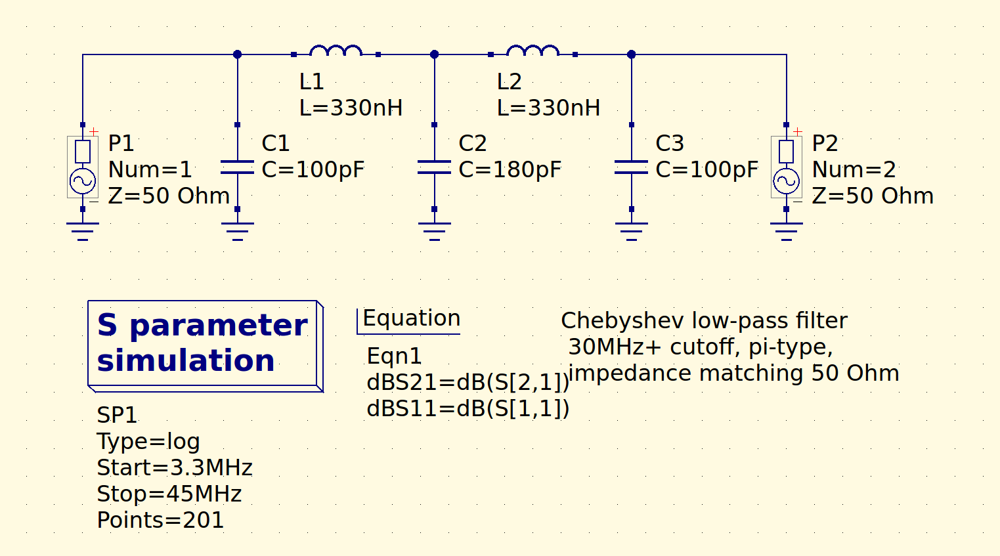
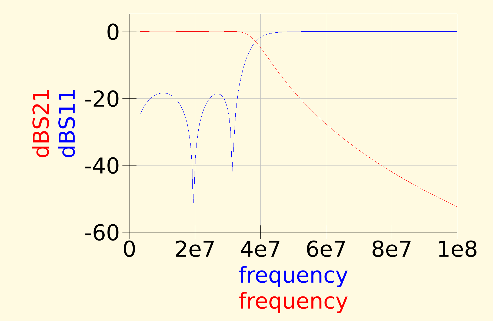

180 pF can be replaced with 2 x 100 pF in parallel, if you don't have 180 pF
handy. 0.33 uH can be airwound or better use `9 turns` on T50-6 yellow toroid
(iron dust core) or `10 turns` on T37-6 yellow toroid (iron dust core).

Note: These filters were simulated with `QUCS` software.
